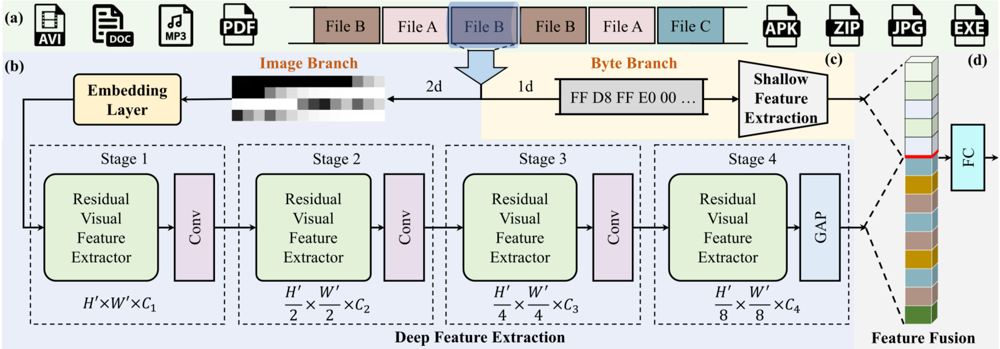
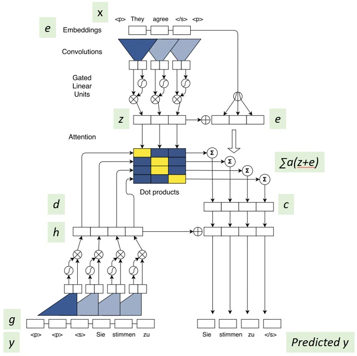
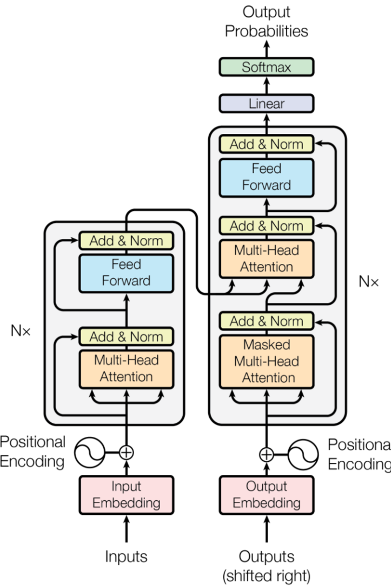
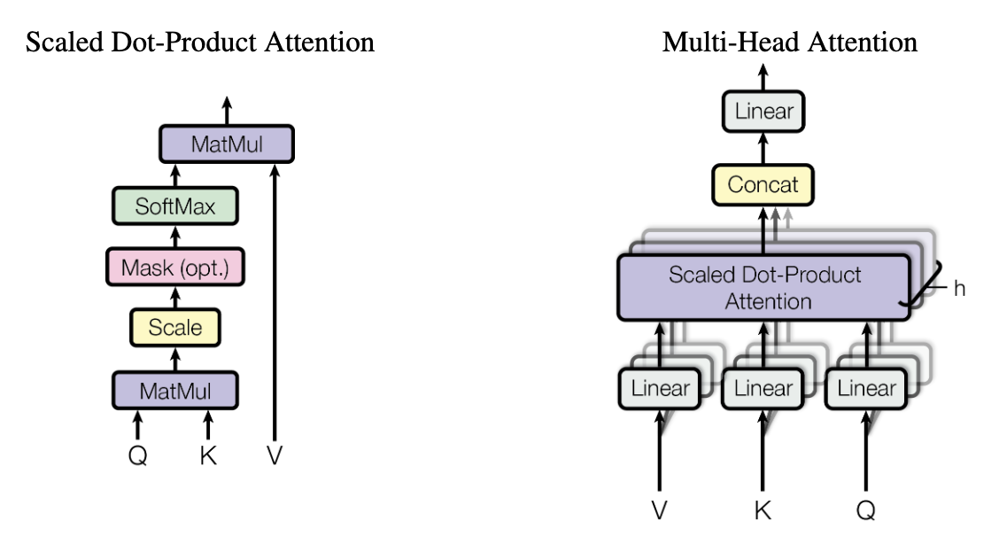
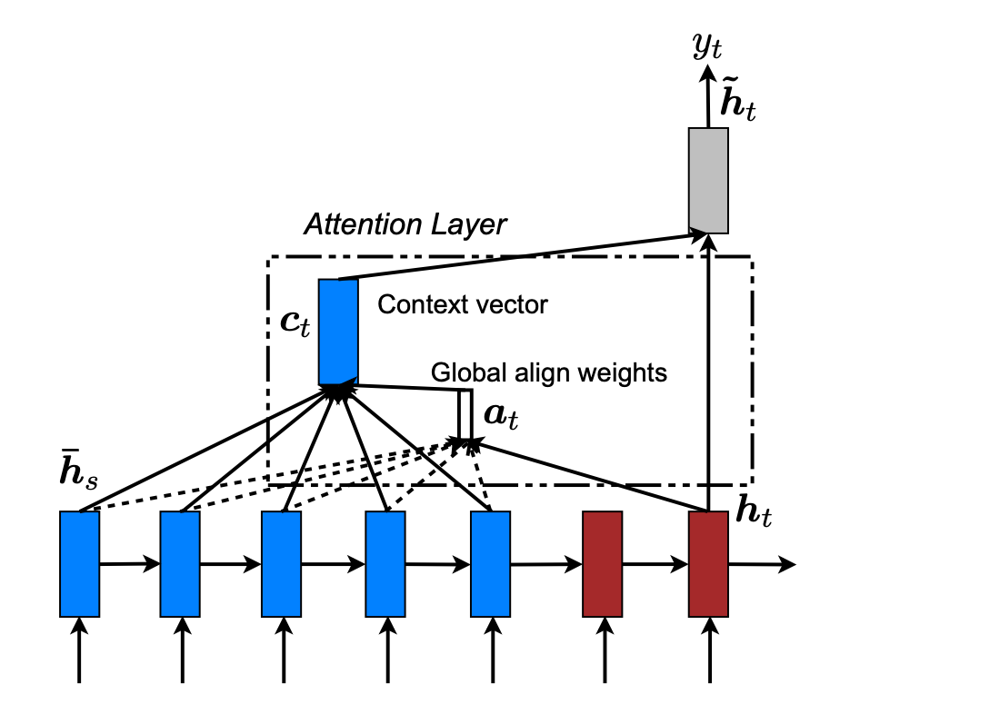
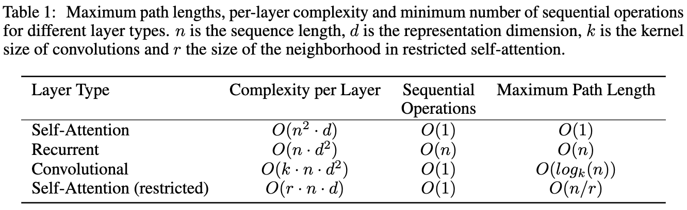
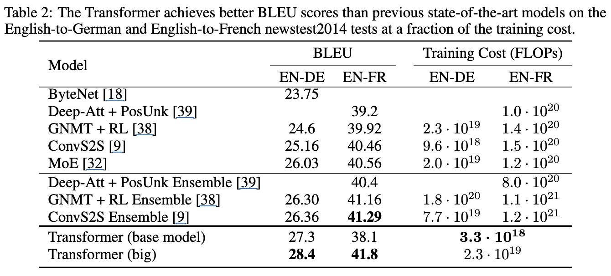
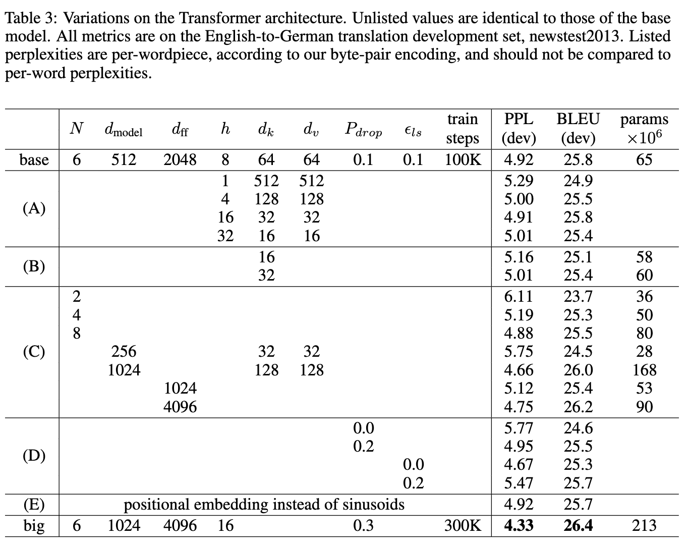
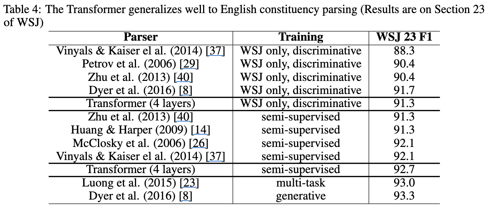

# Introduction
Recurrent neural networks(RNN), Long Short-term Memory(LSTM), gated recurrent neural networks는 language modeling, 기계 번역과 같은 sequence modeling 작업에서 sota를 달성하였다.
### Recurrent Models
Recurrent model은 input과 output의 symbol 위치에 따라 계산을 수행한다. 계산 시점에 위치를 정렬해 이전 hidden state인 $h_{t-1}$과 위치 $t$에 대한 입력의 함수로 hidden state인 $h_t$의 sequence를 생성한다. 이런 순차적인 특징으로 인해 훈련시 병렬화가 불가능하며, 메모리 제약 조건으로 인해 batching이 제한되므로 더 긴 sequence 길이에서 중요해진다.

최근 연구에서는 `factorization tricks`, `conditional computation`을 통해 계산 효율성을 크게 향상시켰으며, conditional computation은 모델의 성능도 함께 향상되었지만 순차적인 계산의 근본적인 제약은 여전히 남아있었다.

### Attention Mechanism
Attention mechanism은 다양한 task에서 설득력 있는 sequence modeling 과 transduction model의 필수적인 부분이 되었고, input과 output sequence에서 거리와 관계없이 dependency을 모델링 할 수 있게 되었지만 몇가지의 경우(*보기)를 제외하고 attention mechanism은 recurrent network와 함께 사용되었다.

이 논문에서는 Recurrence를 피하고 input과 output 간의 global dependency을 도출하기 위해 attention mechanism에 의존하는 model architecture인 `transformer`을 제안하였다. 이는 기존 RNN에서의 문제점인 병렬화를 허용해 8개의 P100 GPU에서 12시간이라는 짧은 시간동안 훈련된 translation 품질에서 sota를 도달하였다.

# Background
순차적 계산을 줄이려는 목표는 `Extended Neural GPU`, `ByteNet`, `ConvS2S` 모델들의 기반이 된다.

이 모델들은 CNN을 사용하며, input과 output의 모든 위치에 대해 hidden representation을 병렬로 계산한다. 이는 서로 떨어진 임의의 input 또는 output 위치 사이의 정보를 연결하기 위해 필요한 연산 횟수가 위치 간 거리의 증가에 따라 달라지며, ConvS2S의 경우 linear, ByteNet의 경우 logarithmic으로 증가하여 떨어진 위치 간 dependency를 학습하는 것이 더 어려워진다.

Transformer에서는 이러한 연산이 constant number의 연산으로 줄어들지만, attention-weighted된 위치들을 평균 내는 방식으로 인해 effective resolution이 감소하는 단점이 있다. 즉, 쉽게 풀어 얘기하면 self-attention은 RNN이나 CNN과 달리 멀리 떨어진 단어들 간의 관계를 연결하기 위해 필요한 연산의 수가 상수가 된다. 즉, 문장의 첫 단어와 마지막 단어를 연결하더라도 계산 단계는 늘어나지 않는다. self-attention은 '나'라는 단어가 '밥', '먹었다', '오늘' 등 여러 단어를 보고 각각의 중요도에 따라 평균적으로 정보를 가져온다. 이로 인해, 단여별로 고유하게 중요한 정보를 뽑기보다 평균적으로 섞인 정보를 얻게 된다. 그래서 중요한 세부 정보가 흐려지거나 낮아지는 일이 생길 수 있다.이는 [`Multi-Head Attention`](#multi-head-attention)을 사용해 보완하게 된다.

### Self-Attention
self-attention은 하나의 sequence 내에서 다른 위치 간의 관계를 파악해 그 sequence의 표현을 계산하는 attention mechanism이다.
Transformer는 sequence-aligned RNN이나 convolution을 전혀 사용하지 않고, self-attention만을 이용해 입력과 출력의 표현을 계산하는 transduction model이다.

# Model Architecture
대부분의 neural sequence transduction model은 encoder-decoder 구조로 구성되어 있다. 즉, input sequence로 $(x_1, ..., x_n)$이 주어지면 연속된 표현인 $z=(z_1, ..., z_n)$으로 변환되고, $z$를 decoder에 주어지면 output sequence인 $(y_1, ..., y_m)$을 한번에 하나씩 생성한다. 이때, 각 단계에서 model은 auto-regressive이며, 다음을 생성할 때, 이전에 생성된 symbol을 추가 입력으로 사용한다.
아래의 구조는 transformer의 전체 구조를 나타낸 그림이다. 이때, 왼쪽과 오른쪽에 각각 encoder와 decoder에 대해 stacked self-attention과 point wise, fully connected layer을 사용한다.

## Encoder and Decoder Stacks
### Encoder
Encoder는 $N=6$개의 동일한 layer의 stack으로 구성되고, 각 layer에는 2개의 sub-layer가 있다. 1번째 sub-layer는 multi-head self-attention mechanism을 사용하고, 2번째 sub-layer는 간단한 positionwise fully connected feed-forward network을 사용한다. 각 sub-layers는 residual connection을 사용하고, 이후, normalization을 적용한다.

$$
LayerNorm(x + Sublayer(x))
$$

residual connection을 쉽게 하기 위해 sub-layer와 embedding layer는 $d_{model} = 512$인 출력을 내놓는다.

### Decoder
Decoder도 Encoder와 마찬가지로 $N = 6$개의 동일한 layer의 stack으로 구성된다. decoder는 encoder stack에 대해 multi-head attention을 수행하는 세번째 sub-layer을 삽입한다. 또한 decoder에서는 self-attetnion을 수정해 현재 이후 위치로 attention을 하는 것을 방지한다. 이러한 masking을 출력 embedding이 한 위치만큼 offset 된다는 사실과 결합되어 위치 $i$에 대한 예측이 $i$보다 작은 위치의 알려진 출력에만 의존할 수 있도록 한다.

## Attention
Attention은 query와 key-value 쌍의 집합을 출력에 mapping하는 것으로 설명할 수 있으며, query, key, value, output은 모두 vector의 형태로 구성되어 있다. Output은 value의 weight sum으로 계산되고 각 value에 할당된 weight는 해당 key을 사용한 query의 compatibility function을 통해 계산된다.

### Scaled Dot-Product Attention

attention의 입력은 차원이 $d_k$인 query와 key, 차원이 $d_v$인 value로 구성된다.
이때, query와 모든 key 간의 dot product을 계산한 후, 각 계산 결과를 $sqrt(d_k)$로 나눈다. 이후, softmax function을 적용해 각 value에 대한 weight을 얻는다.
실제로는 여러개의 query를 동시에 처리하기 위해 query, key, value을 하나의 행렬인 $Q$, $K$, $V$에 묶어서 attention 연산을 수행한다. 이때 출력 행렬은 다음과 같이 계산된다.

$$
Attention(Q, K, V) = softmax(\frac{QK^T}{\sqrt{d_k}})V
$$

일반적으로 사용하는 attention 함수는 [`additive attention`](#additive-attention)과 [`dot-product(multiplicative) attention`](#dot-product(multiplicative)-attention)을 사용한다.

#### dot-product(multiplicative) attention
기존 사용하는 방식과 거의 동일하지만 차이점으로 scaling factor인 $\sqrt{d_k}$가 없다는 차이점이 있다.

#### Additive Attention

additive attention은 1개의 hidden layer을 가진 feed-forward neural network를 사용해 유사도를 계산한다.

위 두 방식은 이론적으로 복잡도가 비슷하지만 ($O(n^2)$) dot-product attention은 최적화된 matrix multiplication으로 쉽게 구현할 수 있기 때문에 매우 빠르고 memory 효율도 높다.

이때, $d_k$가 작은 경우에는 두 방식의 성능이 유사하게 나오지만 $d_k$가 클수록 additive attention이 scaling이 없는 dot-product attention보다 더 좋은 성능을 낸다. 그 이유는 $d_k)$가 커질 수록 dot-product의 값이 매우 커져, softmax 함수가 gradient가 거의 0에 가까운 영역으로 진입한다고 추측한다. 이를 완화하기 위해 dot-product 값을 $\frac{1}{\sqrt{d_k}}$으로 나누어 scaling을 수행한다.

### Multi-Head Attention
이 논문에서는 query, key, value을 각각 $d_{model}$의 차원을 그대로 사용하는 대신, $h$ (multi head 수)개의 서로 다른 학습 가능한 linear projection을 통해 각각의 query, key, value을 $d_k, d_k, d_v$의 차원으로 Linear projection을 하는 것이 더 효과적임을 확인했다. 이를 통해 attention을 병렬로 수행하면 각 head에서 $d_v$차원의 출력이 생성된다. 이를 concatenate한 후, linear projection을 적용하면 최종 attention의 결과가 된다. 이를 통해 서로 다른 위치에 있는 정보들을 동시에 주목(attend) 할 수 있게 해준다.

이전에 말했다시피 단일 attention head만 사용하면 weight averaging 때문에 표현력이 제한된다.

$$
MultiHead(Q, K, V) = Concat(head_1, ..., head_h)W^O
$$
$$
\quad where\; head_i = Attention(QW_i^Q, KW_i^K, VW_i^V)
$$

이때, 사용되는 project 행렬은 다음과 같다.
- $W_i^Q \in R^{d_{model \times d_k}}$
    - query projection
- $W_i^K \in R^{d_{model \times d_k}}$
    - key projection
- $W_i^V \in R^{d_{model \times d_v}}$
    - value projection 
- $W^O \in R^{hd_v \times d_{model}}$
    - final projection

이 논문에서는 총 $h = 8$개의 병렬 attention layer을 사용한다. 이때, 각 head는 $d_{model}$이 아니라 다음과 같은 차원을 사용한다.

$$
d_k = d_v = \frac{d_{model}}{h} = 64
$$

즉, $d_model = 512$라고 가정하면 head는 64차원이 된다. 이를 통해 전체 multi-head attention의 게산 비용은 single head attention과 비슷한 수준으로 유지할 수 있다.

### Applications of Attention in our Model
> Transformer는 multi-head attention을 다음 세가지 방식으로 사용한다.

#### Encoder-Decoder Attention(Cross-Attention)
Encoder-Decoder Attention Layer에서 key와 value는 encoder의 출력에서 가져온다. 이렇게 함으로써, decoder의 모든 위치는 input sequence 전체 위치에 attention을 기울일 수 있다.
> 즉, encoder는 입력 전체를 요약하고, decoder는 그 요약 정보에 접근하여 출력 단어를 생성한다.

#### Encoder Self-Attention
encoder에는 self-attention layer가 포함되어 있다. 이 self-attention layer에서는 query, key, value가 모두 동일한 입력에서 나온다. 이 경우, encoder 내부에서 이전 layer의 출력이 다음 layer의 입력이 된다. 따라서 encoder 내의 각 위치는 encoder 이전 layer의 모든 위치에 주의를 기울일 수 있다.
> 즉, encoder는 입력 sequence 전체의 단어들 간 관계를 스스로 학습하며, 순서에 얽매이지 않고 모든 위치를 참고할 수 있다.

#### Decoder Self-Attention (with Masking)
마찬가지로, decoder 내의 self-attention layer는 decoder의 각 위치가 그 위치까지의 모든 decoder 위치에 주의를 기울일 수 있다. 하지만 auto-regressive 속성을 유지하기 위해 오른쪽(미래 방향)의 정보가 왼쪽(과거 위치)으로 흘러가는 것(leftward information flow)을 막아야 한다. 이를 위해 scaled dot-product attention 내부에서 masking을 수행한다. 즉, softmax 입력에서 허용되지 않은 연결(미래 정보)에 해당하는 값들은 $-\inf$로 설정하여 softmax의 결과가 0이 되도록 만든다
> 즉, decoder는 다음 단어를 예측할 때, 아직 생성되지 않은 미래 단어들을 참고하지 못하도록 제한한다.

## Position-wise Feed-Forward Networks
attention sub-layers 외에도, encoder와 decoder의 각 layer에는 fully connected feed-forward network를 포함하고 있으며, 이 네트워크는 입력 sequence의 각 위치에 개별적으로 그리고 동일한 방식으로 적용된다. 이 feed-forward network는 2개의 linear transformation으로 구성되어 있으며, 그 사이에 ReLU activate function이 적용된다. 수식으로는 다음과 같이 표현된다.

$$
FFN(x) = max(0, xW_1 + b_1)W_2 + b_2
$$
- $x$: input vector
- $W_1, W_2$: weight matrix
- $b_1, b_2$: bias vector
- $max(0, ...)$: ReLU activate function

이 linear  transformation은 서로 다른 위치에 대해서는 동일한 방식으로 적용되지만, layer가 다르면 서로 다른 parameter을 사용한다. 이 구조는 kernel 크기 1짜리 convolution 연산 2개로도 표현할 수 있다.
쉽게 얘기하면 입력 sequence 각각의 token vector에 대해 동일한 계산을 반복한다는 것이 word1, word2, ...에 모두 동일한 FFN으로 계산되고, 각각 layer마다 다른 독립된 FFN을 사용한다.
> 즉, 각 위치마다 독립적으로 적용되는 연산이다.

입력과 출력의 차원은 $d_{model} = 512$이고, hidden layer의 차원은 $d_{ff} = 2048$이다. 즉, input vector는 먼저 2048차원으로 확장된 후, 다시 512차원으로 줄어든다.

## Embeddings and Softmax
다른 sequence transduction model들과 마찬가지로 학습된 embedding을 사용해 input token과 output token을 차원 $d_{model}$을 갖는 vector로 변환한다. 또한 일반적으로 사용되는 학습된 linear transformation과 softmax function을 사용하여 decoder의 출력을 다음 token의 확률 분포로 변환한다.
> 즉, decoder의 마지막 출력은 V차원으 확률 분포로 바뀌며, V는 vocabulary 크기가 된다.

transformer에서는 input embedding layer과 output embedding layer, softmax 이전의 linear transformation 사이에 동일한 weight matrix을 공유한다. 즉, 세군데에서 동일한 weight를 공유함으로써 parameter의 수를 줄이고 일반화 성능을 높이는 효과를 기대한다.
embedding layer에서는 해당 weight에 $\sqrt{d_{model}}$을 곱해준다. 이 scaling은 embedding 값의 분산을 조절하기 위한 것으로, 초기 학습 안정성과 성능 향상에 도움을 줄 수 있다.

## Positional Encoding
Transformer는 recurrence나 convolution을 포함하지 않기 때문에 sequence의 순서 정보를 모델이 활용할 수 있게 하기 위해서 token들의 상대적, 절대적 위치 정보를 인위적으로 주입해야 한다. 즉, Transformer는 RNN처럼 순서를 따라 계산하지 않고, CNN처럼 local 정보를 보지 않기 때문에, 위치 정보를 따로 넣어줘야 한다. 이를 위해 positional encoding을 input embedding에 더하여, encoder와 decoder stack의 가장 하단에 위치 정보를 삽입핮ㄴ다. 이때, positional encoding은 embedding과 동일한 차원인 $d_{model}$을 가지고, 두 vector을 더할 수 있도록 설계되었다. 이때, encoding 방식으로 positional encoding이 학습되는 방식과 고정된 방식 등 여러가지가 있다. 이 논문에서는 고정된 방식인 서로 다른 주파수를 가지는 sine function과 cosine function을 이용하는 방법을 사용했다.
$$
PE_{(pos, 2i)} = sin(\frac{pos}{10000^{\frac{2i}{d_{model}}}})
$$

$$
PE_{(pos, 2i+1)} = cos(\frac{pos}{10000^{\frac{2i}{d_{model}}}})
$$
- $pos$ : 위치
- $i$ : 차원 index

즉, positinal encoding의 각 차원은 하나의 사인파에 대응된다. 이 사인파들의 파장은 $2\pi$부터 $10000 \cdot 2\pi$까지 기하급수적으로 증가한다. 즉, 낮은 차원은 빠르게 변하고, 높은 차원은 천천히 변하는 sine/cosine 패턴을 가지게 된다. 이 함수를 사용하는 이유는 상대적인 위체에 따라 쉽게 attention을 배울 수 있을거라 가정했기 때문이다. 고정된 거리 $k$만큼 떨어진 위치 $PE_{pos+k}$의 positional encoding은 $PE_{pos}$의 positional encoding의 linear function으로 표현될 수 있기 때문이다. 이 논문에서는 sinusoidal의 positional encoding을 선택했는데 그 이유로, 학습 시보다 더 긴 sequence에 대해서도 일반화가 가능할 것으로 기대되었기 때문이다. 즉, 학습한 길이 범위를 벗어난 입력에서도 위치 정보를 생성할 수 있다는 것이 sine/cosine 방식의 장점이 된다.

# Why Self-Attention
self-attention layer와 일반적으로 사용되는 recurrent layer, convolutional layer를 비교한다. 이 layer들은 $(x_1, ..., x_n)$ 형태의 가변 길이 sequence를 동일한 길이의 sequence인 $(z_1, ..., z_n)$으로 매핑하는데 사용되며 $x_i, z_i$는 $R^d$에 속한다. 이는 sequence transduction에서 encoder와 decoder의 hidden layer에서 흔히 나타나는 구조이다. Self-attention을 사용하는 근거를 설명하기 위해 3가지의 기준을 고려하였다고 한다.
1. Total computational complexity per layer (layer 당 전체 계산 복잡도)
2. Amount of computation that can be parallelized (병렬화가 가능한 계산의 양)
3. path length between long-range dependencies in the network(network 내에서 장거리 의존 사이의 경로 길이)

장거리 의존 관계를 학습하는 능력에 영향을 주는 주요 요소 중 하나는 forward, backward 신호가 network를 통해 이동해야 하는 경로의 길이가 된다. 이때, 입력과 출력 sequence 내 모든 위치 쌍 간의 경로가 짧을수록, 장거리 의존성을 학습하기 쉬워진다.

위 표에서 보다시피 self-attention layer는 모든 위치를 연결하면서 상수의 연산만을 필요로 한다. 이에 반변, recurrent layer는 $O(n)$의 sequential operation이 필요하다. 즉, self-attention은 순차 계산이 거의 없고 병렬 처리에 유라하는 뜻이 된다.

computational complexity 측면에서, sequence 길이 n이 representation 차원 d보다 작을 경우, self-attention은 recurrent layer보다 더 빠르다. 이는 최신 machine translation에서 사용되는 word-piece나 byte-pair 표현 방식에서 자주 나타나는 상황이다.

### Word-piece
> 단어를 의미 있는 더 작은 조각(subword)으로 분리하는 방식의 tokenizer

자주 등장하는 단어는 그대로 보존하고, 낮은 빈도의 단어는 여러 subword로 분해한다.
- 단어: unhappiness
    - tokenize 결과: [un, ##happiness]
- 단어: playfully
    - tokenize 결과: [play, ##full, ##ly]

이는 out-of vocabulary를 피할 수 있다는 장점이 있다. 즉, 생소한 단어도 subword 조합으로 분해해 처리가 가능하다. 이는 영어와 같은 알파벳 기반 언어에서 효과적이다.

### Byte-pair
초기에 모든 단어를 문자 단위로 쪼갠다. 이후, 가장 자주 등장하는 문자 쌍을 병합하고 병합된 쌍을 하나의 새로운 token으로 간주하고 반복한다. 이때, 원하는 vocab size까지 진행한다.

매우 긴 sequence를 다루는 작업의 computational 성능을 향상시키기 위해, self-attention을 출력 위치를 중심으로 입력 sequence 내 반경 r 크기의 이웃만 고려하도록 제한할 수 있다. 이 경우, 최대 경로 길이는 $O(n/r)$로 증가하게 된다.

kernel 너비 k가 n보다 작은 하나의 convolutional layer는 모든 입력-출력 위치 쌍을 연결하지 못한다. 모든 위치를 연결하려면 contiguous kernel의 경우, O(n/k)개의 convolution layer을 쌓아야 하며, dilated convolution의 경우에는 $O(log_k(n))$개가 필요하다. 이로 인해, network 내 두 위치 사이의 최장 경로가 증가하게 된다. 일반적으로 convolutional layer는 recurrent layer보다 computational 비용이 더 크며, 거의 k배에 이른다고 한다. 하지만 separable convolution을 사용하면 복잡도를 $O(k\cdot n\cdot d + n\cdot d^2)$로 줄일 수 있다고 한다.

하지만, k=n인 경우에도 separable convolution의 복잡도는 self-attention layer와 point-wise feed-forward layer의 조합과 동일하다. 즉, 연산량 면에서 transformer의 구조와 유사하다. 추가적인 장점으로 self-attention을 통해 해석 가능한 모델을 만드는데 도움이 될 수 있다. 즉, 각 attention head는 서로 다른 역할을 학습하며, 문장의 문법적, 의미적 구조와 관련된 행동을 보인다고 한다.

# Training
## Training Data and Batching
약 450만개의 문장 쌍으로 구성된 표준 WMT 2014 English-German dataset을 사용해 훈련을 진행.
- Byte-Pair Encoding (BPE) 방식
    - 37,000개의 token으로 구성된 vocabulary 생성

English-to-French 쌍의 경우 3,600만 개의 문장 쌍이 포함된 WMT 2014 English-French dataset을 사용하였고, 32,000개의 word-piece vocabulary로 token을 분할하였다. 각 train batch는 약 25,000개의 source token과 25,000개의 target token을 포함하는 문장 쌍 집합으로 구성되었다.

## Hardware and Schedule
- 8개의 NVIDIA P100 GPU
- 한 번의 training step: 약 0.4s
- Base model을 100,000 step의로 12시간동안 훈련
- Big model은 한 step 당 1.0s 걸리고, 300,000 step(약 3.5일)동안 훈련 진행

## Optimizer
`Adam Optimizer` 사용
- $\beta_1 = 0.9$
- $\beta_2 = 0.98$
- $\epsilon = 10^{-9}$

이때, learning rate는 훈련 도중 다음 수식에 따라 변화 시킴.
$$
lrate = d_{model}^{-0.5} \cdot min(step_num^{-0.5}, step_num \cdot warmup_steps^{-1.5})
$$
이는 훈련 초반에 학습률을 linear하게 증가시킨 후, step 수의 inverse square root에 비례해 감소시켰다. 이때, $warmup_steps=4000$을 사용했다.

## Regularization
2가지 정규화 기법 사용
### Residual Dropout
각 sub-layer의 출력에 dropout을 적용한 후, 이를 sub-layer의 입력에 더하고 normalization을 수행한다. encoder와 decoder stack에서 embedding과 positional encoding에서도 dropout을 적용한다.

Base model에서는 dropout의 비율을 $P_{drop} = 0.1$로 설정하였다고 한다.

### Label Smoothing
훈련 중 label smoothing 기법을 적용하였고, smoothing의 값은 $\epsilon_{ls} = 0.1$로 설정하였다고 한다. 이는 모델이 정답에 대해 덜 확신을 갖게 되므로 perplexity는 증가하지만 결과적으로 accuracy와 BLEU score는 향상되었다고 한다.

# Result
## Machine Translation

WMT 2014 English-to-German 번역 task에서 transformer (big) model은 기존 모델보다 BLEU score가 2.0 이상 높아졌다. sota BLEU score로 28.4를 달성하였다.

이 모델의 구성은 위 표에서 마지막 행에 제시되어 있는 것과 같다. P100 GPU 8rodptj 3.5일 동안 학습하였으며, base model도 기존 공개된 모델 및 emsemble보다 뛰어난 성능을 보이며, 기존 모델보다 훨씬 낮은 학습 비용으로 훈련되었다.

WMT 2014 English-to-French 번역 task에서는 transformer (big) model이 BLEU score 41.0을 달성하여 기존 공개된 single model 중 가장 높은 성능을 기록하였다. 이는 이전 sota model의 1/4 미만의 학습 비용으로 훈련되었다고 한다. English-to-French용 big model은 dropout을 $P_{drop} = 0.1$을 사용하였으며, English-to-German보다 0.3 낮은 값을 사용하였다.

base model의 경우 마지막 5개의 checkpoint를 평균내어 single model을 구성하였으며, 각 checkpoint는 10분 간격으로 저장되었다고 한다. big model에서는 마지막 20개의 checkpoint를 평균내었다고 한다. Inference 시에는 beam search를 사용하였고, beam size는 4, length penalty $\alpha = 0.6$을 사용했다고 한다. max output length는 input length의 +50으로 설정하였지만, early stopping을 사용했다고 한다.

## Model Variations
> base model을 여러 방식으로 변형해 transformer의 구성 요소 중 어떤 것이 중요한지 평가

- English-to-German development set인 newsstest2013에서 성능 변화 측정
- checkpoint averaging은 사용 안함

table 3의 (A)에서 attention head 수와 attention key/value의 차원을 변경하면서 계산량은 일정하게 유지하였을 때, single-head attention은 BLEU score가 0.9 낮았고, head 수가 지나치게 많아도 성능이 저하되었다고 한다.

(B)에서는 attention key 차원인 $d_k$를 줄이면 모델 성능이 덜어지는 것을 관찰했다고 한다.

(C)와 (D)에선 model이 커질수록 성능이 좋아지고, dropout이 overfitting 방지에 효과적임을 확인했다.

(E)에서는 sinusoidal positional encoding을 learned positional embedding로 대체했지만, base model과 거의 동일한 성능을 보였다고 한다.

## English Constituency Parsing
transformer가 다른 task에서도 적용이 가능한지 다른 `English
constituency parsing` task에서 확인.

이때, 어려움이 발생
- 출력이 강한 구조적 제약을 받음
- 출력 sequence가 입력보다 훨씬 김
- RNN 기반 sequence-to-sequence model들은 data가 적은 상황에서 sota를 달성하지 못한 전례가 있음

훈련은 $d_{model}=1024$인 4-layer transformer을 Penn Treebank의 WSJ 부분에서 훈련했다고 하고, 약 4만개의 문장을 포함한다고 한다. 또, semi-supervised 설정에서도 학습하였고, 이때, high-confidence, BerkeleyParser data로부터 얻은 약 1,700만개의 문장이 사용되었다고 한다.

이때, WSJ-only 설정에서는 16K vocab, semi-supervised 설정에서는 32K vocab을 사용했다고 한다. hyperparameter는 Section 22 development set에서 dropout(attention, residual), learning rate, beam size만 약간의 실험을 통해 조정되었고, 나머지는 English-to-German base model과 동일하게 유지하였다고 한다. 또, inference는 max output lenght = input length + 300을 사용하고, beam size=21, $\alpha=0.3$으로 고정하였다고 한다.

table 4에 따르면 특정 task에 특화된 tuning을 하지 않았음에도 transformer는 놀라운 성능을 보였다고 한다. 이는 Recurrent Neural Network Grammar을 제외한 모든 기존 모델보다 좋은 성능을 달성하였고, RNN 기반 sequence-to-sequence model들과 달리 tansformer는 WSJ 4만 문장만 사용했을 때도 BerkeleyParser을 능가했다고 한다.

# Conclusion
Transformer는 attention mechanism만을 기반으로 하는 최초의 sequence transduction model로써, 기존의 encoder-decoder 구조에서 일반적으로 사용되던 recurrent layer을 모두 제거하고, multi-head self-attention으로 완전히 대체한 모델이다. 이를 통해 다른 task에도 적용할 가능성을 보였고, text 이외의 다른 modality(ex. image, audio, video...)을 포함하는 문제로 확정하고, local하고 제한된 attention mechanism을 연구해 대규모 입력과 출력을 효율적으로 처리하는 방안도 연구한다고 한다.